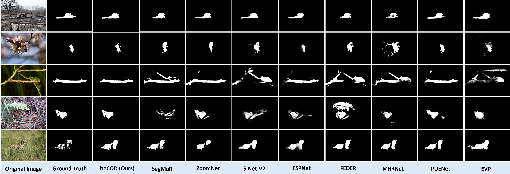
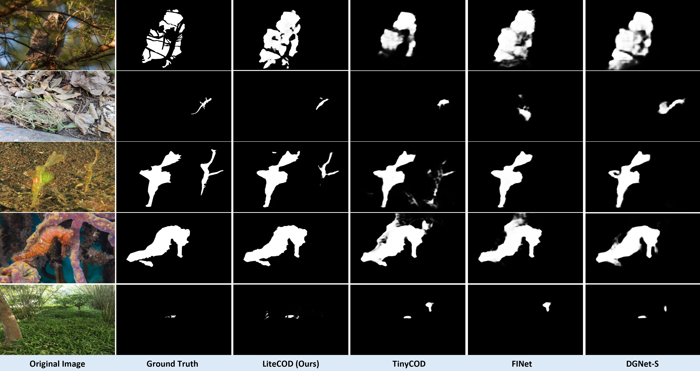

## Qualitative Comparison with State-of-the-Art Methods

  

**Figure 2.** Qualitative comparison of LiteCOD with recent COD methods across diverse challenging scenarios. The comparison includes SegMaR, ZoomNet, SINet-V2, FSPNet, FEDER, MRRNet, PUENet, and EVP across five different test cases showing various camouflaged objects (including what appears to be camouflaged animals and objects in natural environments). Each row shows the original image, ground truth mask, and segmentation results from LiteCOD (ours) and the comparison methods. The results demonstrate LiteCOD's superior performance in accurately detecting and segmenting camouflaged objects while maintaining better boundary preservation and structural fidelity compared to existing approaches.

## Qualitative Results Comparison with other Lightweight Methods

  

**Figure 3.** Qualitative comparison between our proposed method and contemporary lightweight COD approaches (TinyCOD, FINet, and DGNet-S) across diverse challenging scenarios. Our lightweight approach demonstrates superior boundary preservation and structural fidelity compared to other efficient methods, particularly excelling in cases involving both large-scale and minute camouflaged targets and complex textural patterns. These results validate the effectiveness of our proposed architecture in achieving high-quality detection while maintaining computational efficiency suitable for practical deployment.

